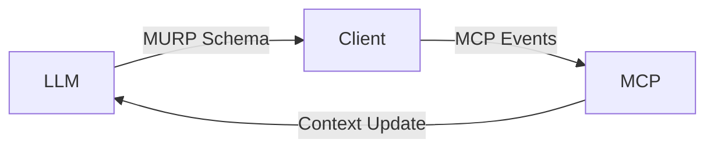

# **Model UI Rendering Protocol (MURP)**  
*An open protocol for dynamic UI rendering between LLMs, MCP, and external tools*

**Documentation** | **Specification** | **Discussions**  

---

## **Overview**  
The **Model UI Protocol (MUP)** is an open standard that enables seamless UI interoperability between large language models (LLMs), Model Context Protocol (MCP) systems, and external tools. Whether you're building AI-generated interfaces, tool-embedded chat applications, or context-aware workflows, MURP provides a unified way to:  

1. **Decouple UI rendering** from model logic  
2. **Standardize component definitions** for cross-platform compatibility  
3. **Enable bidirectional updates** between models and rendered interfaces  

---

## **Core Concepts**  

### 1. **Universal Component Schema**  
JSON-based definition for UI elements (inspired by React/Vue but tool-agnostic):  
```json
// ...
```

### 2. **Render Context Protocol**  
Extends MCP to include UI-specific context:  
```yaml
// ...
```

### 3. **Dynamic Update Mechanism**  
- **Model → UI**: Push component trees with versioned updates  
- **UI → Model**: Stream user interactions as structured events  

---

## **Use Cases**  
✅ **AI-Assisted Form Builders**  
✅ **Tool-Embedded Chat Interfaces**  
✅ **Context-Aware Dashboards**  
✅ **Multi-Model Workspaces**  

---

## **Example Workflow**  
1. LLM generates UI schema via MURP  
2. Client renders components using local toolkit  
3. User interaction triggers MCP context updates  
4. Model receives updates and regenerates UI  



---

## **Why Standardize?**  
- 🛠️ **Eliminate vendor lock-in** for AI-generated UIs  
- ⚡ **Reduce latency** by separating rendering from model inference  
- 🔄 **Enable hybrid interfaces** (human+AI editable)  
